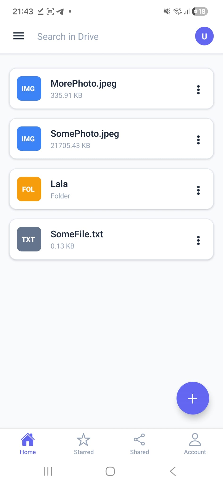
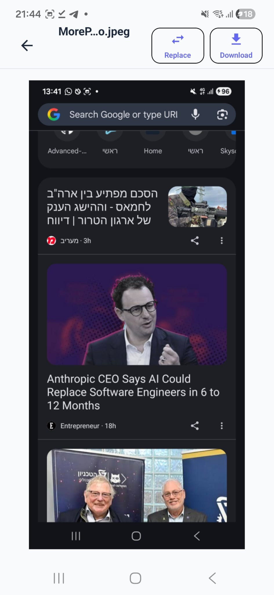
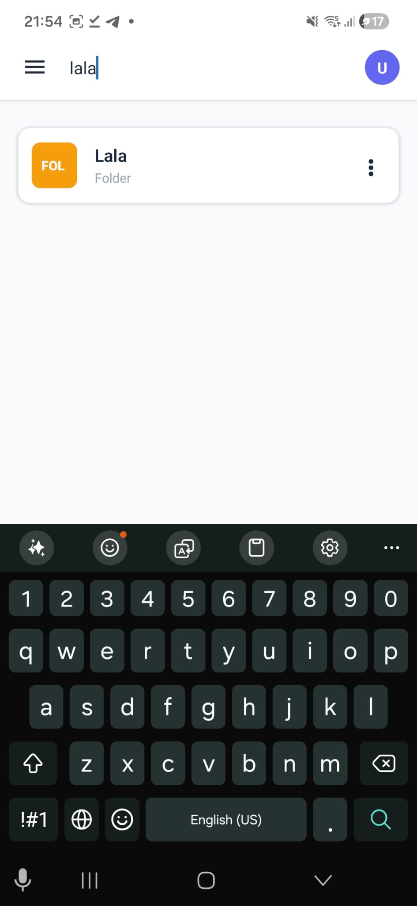
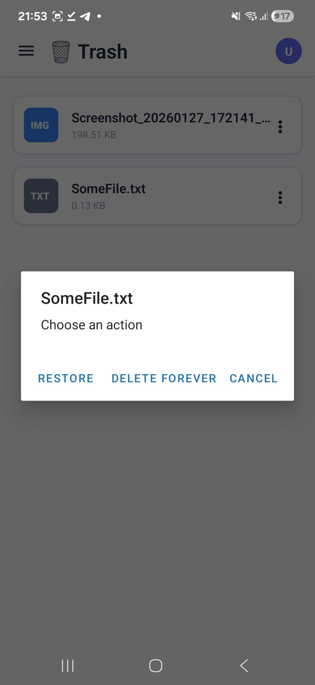
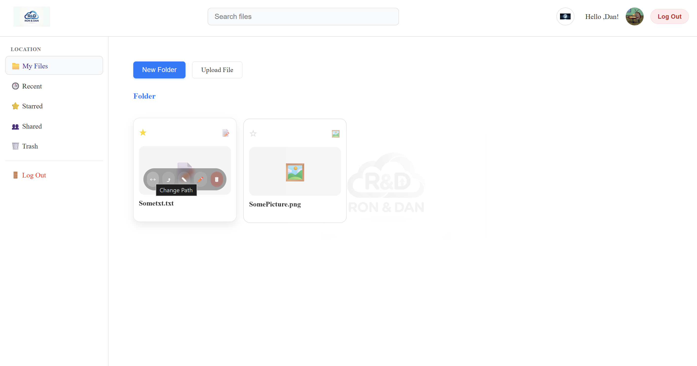
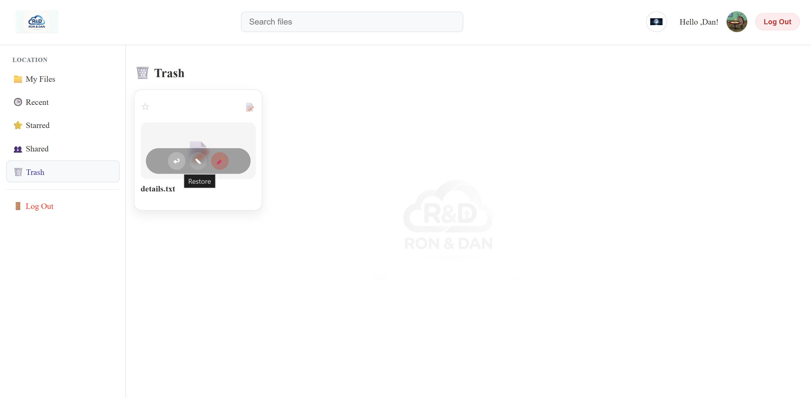
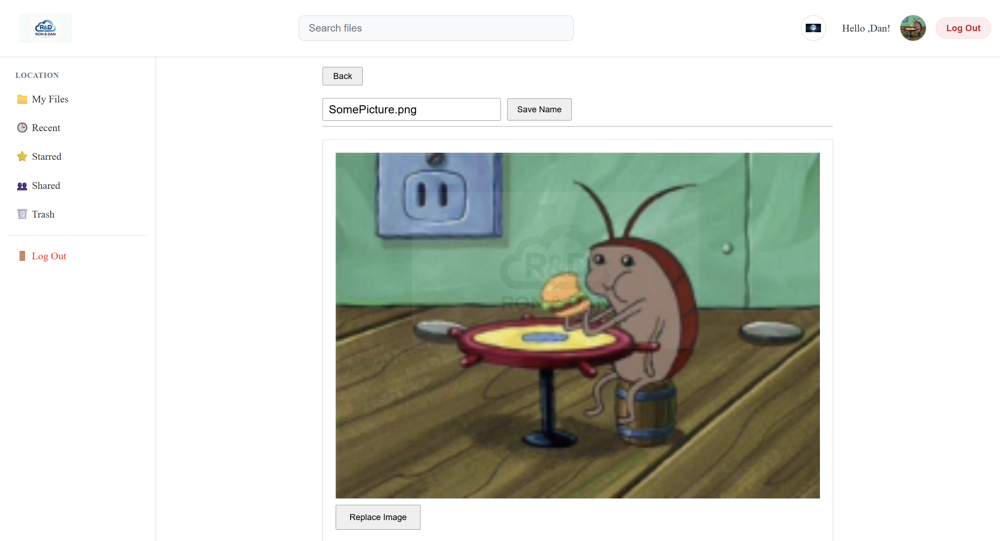
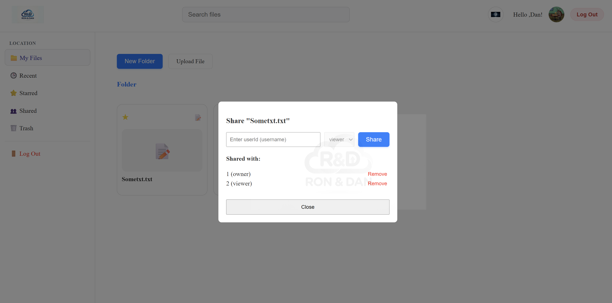

# Advanced-Programming-Project – Exercise 5
https://github.com/Advanced-Programming-Project-Ron-Dan/Advanced-Programming-Project-ex5

This project is a complete file storage system featuring a **React Native (Expo) mobile client** and a **Node.js REST API server** (MVC architecture).         
The Node.js server acts as a wrapper for the **C++ TCP file-storage server (from Exercise 2)**, managing data persistence via **MongoDB**.      
The mobile UI is designed with inspiration from **Google Drive**, offering a clean interface with a side menu, file list, and floating action button for easy management.   

## System Components
- **C++ TCP Server** – Responsible for low-level file content storage and content search via TCP.
- **node (Node.js / Express API)** – The main backend. Exposes REST endpoints for the mobile app, manages users/metadata in MongoDB, and communicates with the C++ server.
- **mongo (MongoDB)** – Database for storing user data, file metadata, and directory structure.
- **mobile (React Native / Expo)** – The frontend client. A native mobile app for Android/iOS allowing users to register, login, and manage their files.

---

## Main Features
- **User Authentication:** Register and Login using JWT tokens. Includes input validation and profile image selection (Gallery/Camera).
- **File Management:** Browse folders recursively, Create folders, and Upload files (Images/Text).
- **File Viewer:**
- **Images:** Full-screen viewing.
- **Text:** View and Edit content directly in the app.
- **Views:** My Drive (Root), Recent, Starred, Trash, Shared.
- **Actions:** Rename, Delete (Soft delete), Restore, Delete Forever, Star/Unstar.
- **Sharing:** Share files with other users (Viewer role permissions).
- **Search:** Filter files by name using the top search bar.
- **UI/UX:** Side navigation menu, "Three-dots" context menu for items, and a "Plus" button for creation actions.

---

## Project Structure (High Level)
- **mobile/** – React Native Expo application (Screens, Components, Context, API hooks).
- **node/** – Express API server (Routes, Controllers, Services, Gateways).
- **ex2-3/** – C++ TCP server source code.
- **docker-compose.yml** – Orchestration for backend services.

## Running the Project

### 0. Prerequisites
- **Docker Desktop** installed and running.
- **Node.js** installed (to run the mobile app via Expo).
- **Expo Go** app on your phone (or an Android/iOS Simulator).

### 1. Start Backend Services
Open a terminal in the project root folder and run:

docker-compose up --build

What this does:
Starts MongoDB.      
Builds and runs the C++ TCP Server.         
Builds and runs the Node.js API (web), connected to Mongo and the C++ server.      
To stop the services, run: 

docker-compose down

### 2. Run the Mobile App
Open a new terminal window:

cd mobile
npm install
npx expo start

⚠️ Important: Connecting to the API (Network Configuration)
Since the app runs on a mobile device/emulator, it cannot access localhost directly.
Android Emulator: The API URL is usually http://10.0.2.2:5000.
Real Device (LAN): Use your PC's local IP address (e.g., http://192.168.1.15:5000).
Make sure to update the API_BASE URL in: mobile/api/config.js (or the relevant config file) before running the app.

# How to Use the App
## Navigation Basics
-Tap a folder to open it.
-Tap a file to view it (Image) or edit it (Text).      
-Back Arrow: Return to the previous screen.

## Side Menu: Navigate between My Drive, Recent, Starred, Trash, and Shared.

## My Drive (Home)
-Shows your files and folders.     
-Search: Type in the top bar to filter items by name.      
-Create Folder: Tap the + button -> "Create Folder".          
-Upload: Tap the + button -> "Upload" -> Pick an image or text file.

## File Actions (Three-Dots Menu)
-Tap the three dots (⋮) on any item to open the menu:    
-Download: Opens the download link in the device browser / system downloader.        
-Rename: Change the file/folder name (extensions are protected).          
-Star: Add/Remove from the "Starred" view.    
-Share: Grant access to another user (enter their username).        
-Delete: Move to Trash.

## File Viewer & Editor
-Images: View full screen. Owner can replace the image content.     
-Text Files: Owner can edit the text and click Save. Viewer is read-only.

## Trash & Recovery
-Trash View: Shows deleted items.  
-Restore: Returns the item to its original folder.    
-Delete Forever: Permanently removes the file from the system.

### How it should look:
#### 1:

#### 2:

#### 3:

#### 4:

#### 5:

#### 6:

#### 7:

#### 8:

