# WIKI — File Storage System
This document explains how to run the project and demonstrates the main features using screenshots.
The backend runs via Docker Compose, and the mobile app runs via Expo.

## 1. Project Structure (Quick Overview)
This project includes:
- **Mobile client** (React Native + Expo) located under `mobile/`
- **Backend API** (Node.js/Express) serving `/api/...`
- Backend services are started together using **Docker Compose**

### Prerequisites
- Download the Expo Go app
- Make sure your phone and your computer are on the same Wi-Fi network
- Docker and Docker Compose
- Node.js and npm

## 2. How to Run (Mobile)
### 2.1 Enter the mobile folder
Run:
cd mobile

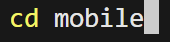

### 2.2 Install dependencies
Run:
npm install

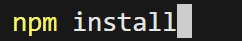

### 2.3 Start Expo
Run:
npx expo start

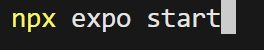

## 3. How to Run (Docker Compose / Backend)
If the project is configured with Docker Compose, run from the repository root:
docker compose up --build

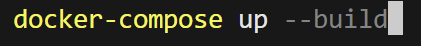

## 4. Authentication
### 4.1 Register
Creates a new user account.

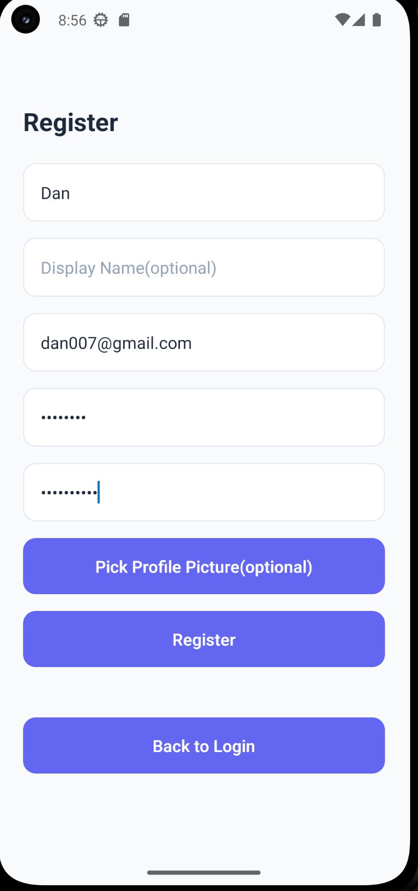

### 4.2 Login
Logs in and receives an authentication token used for API requests.

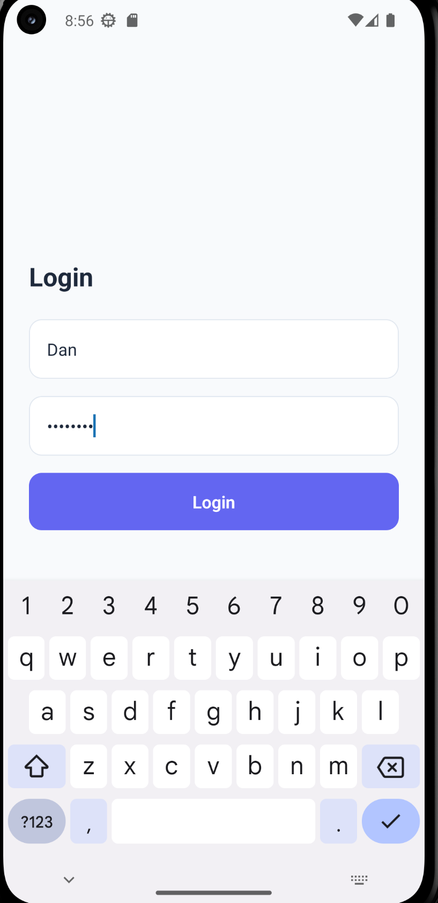

## 5. My Drive (Root View)
Displays the user’s root files and folders (similar to Google Drive "My Drive").
Allows navigating into folders and opening file actions.

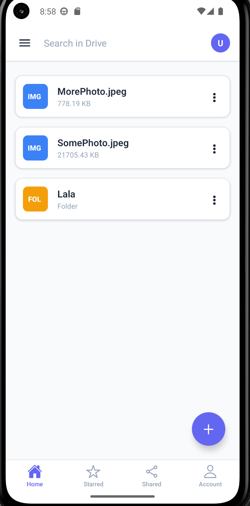

## 6. Upload File + Create Folder (Main Actions)
Upload: Select and upload a file (text/image).
Create folder: Create a folder in the current directory.

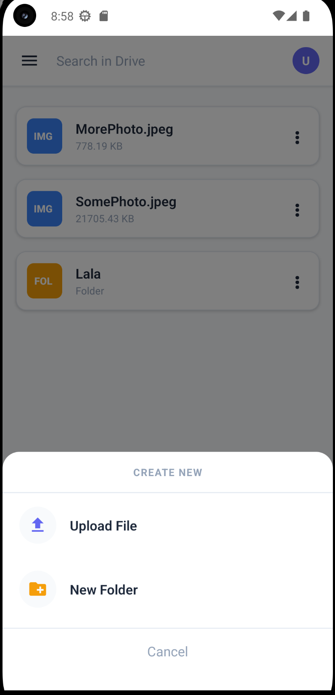

## 7. Create Folder (Example)
Demonstrates creating a folder through the UI.

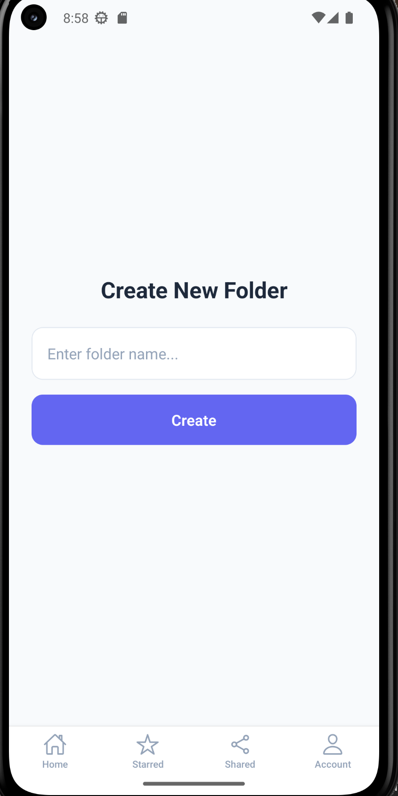

## 8. File Actions (Three Dots Menu)
Opens the actions menu for a file/folder (e.g., rename, share, star, move to trash).

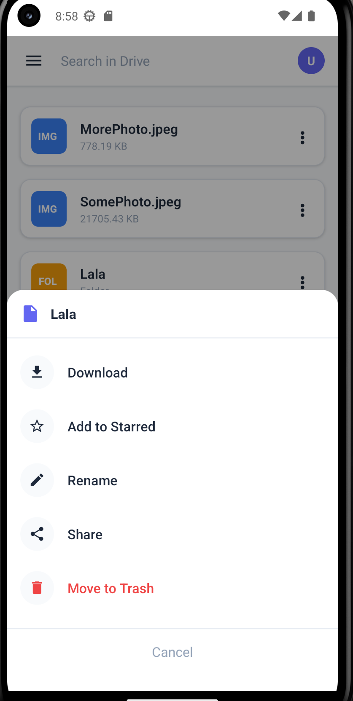

## 9. Rename
Renames a file or folder (updates metadata on the server).

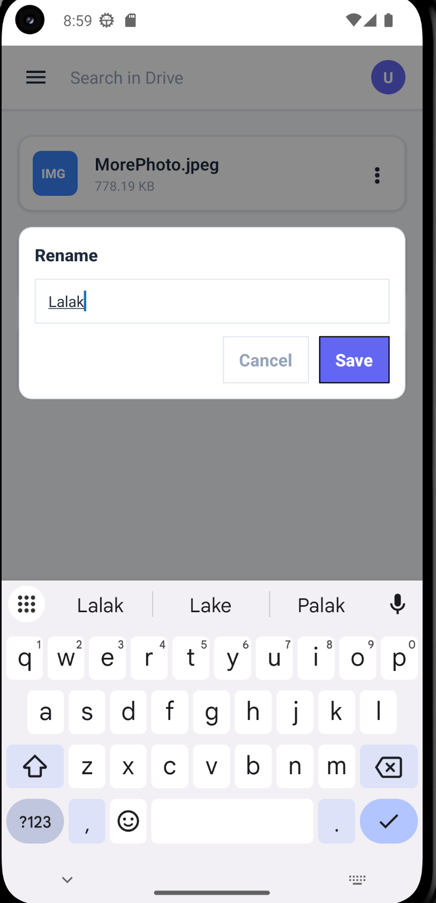

## 10. Starred
Mark/unmark files as starred.
View starred items in the Starred screen.

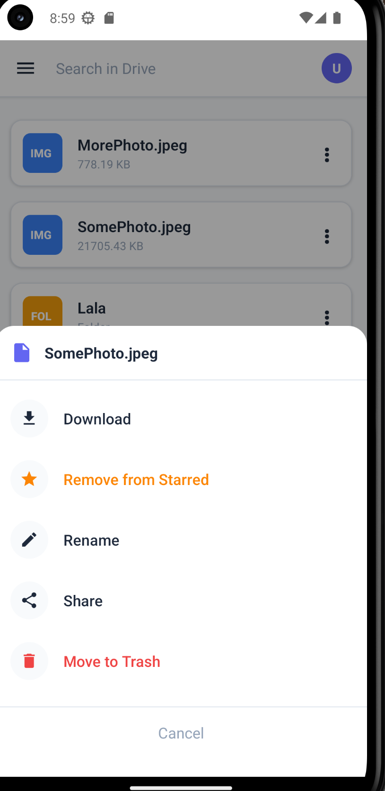

## 11. Share
Shares a file/folder with another user (permission-based sharing).
The shared user can access it from the Shared screen.

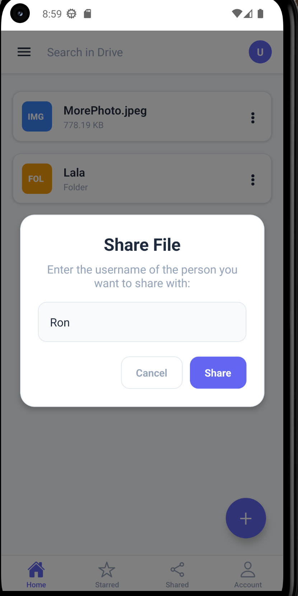

## 12. Trash — Restore + Delete Forever
Move to Trash is a soft delete.
Restore brings an item back from Trash.
Delete Forever permanently deletes the item.

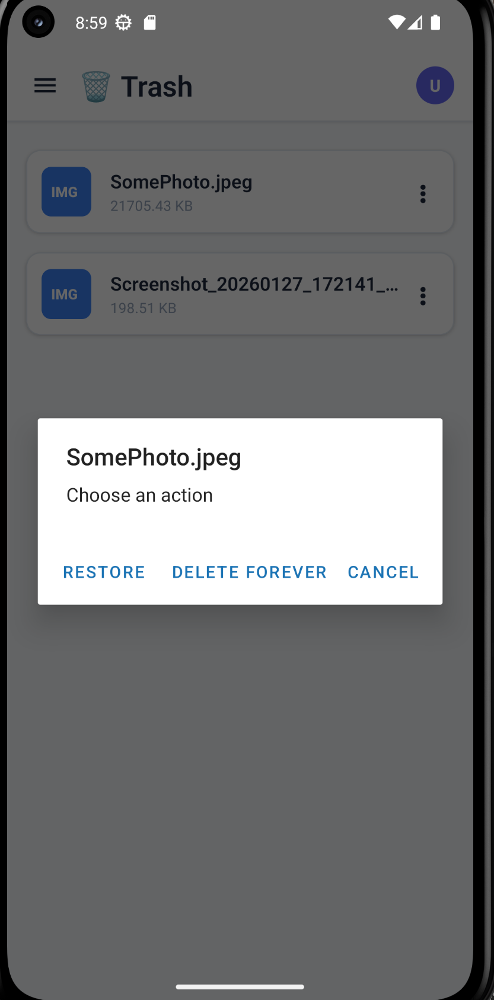

## 13. Search
Search files/folders by query (e.g., filename; and/or content depending on backend implementation).

